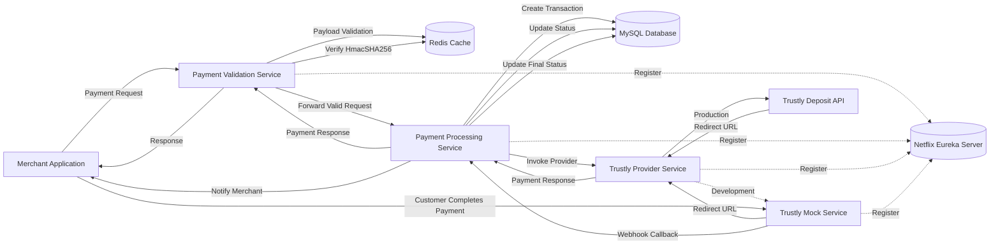
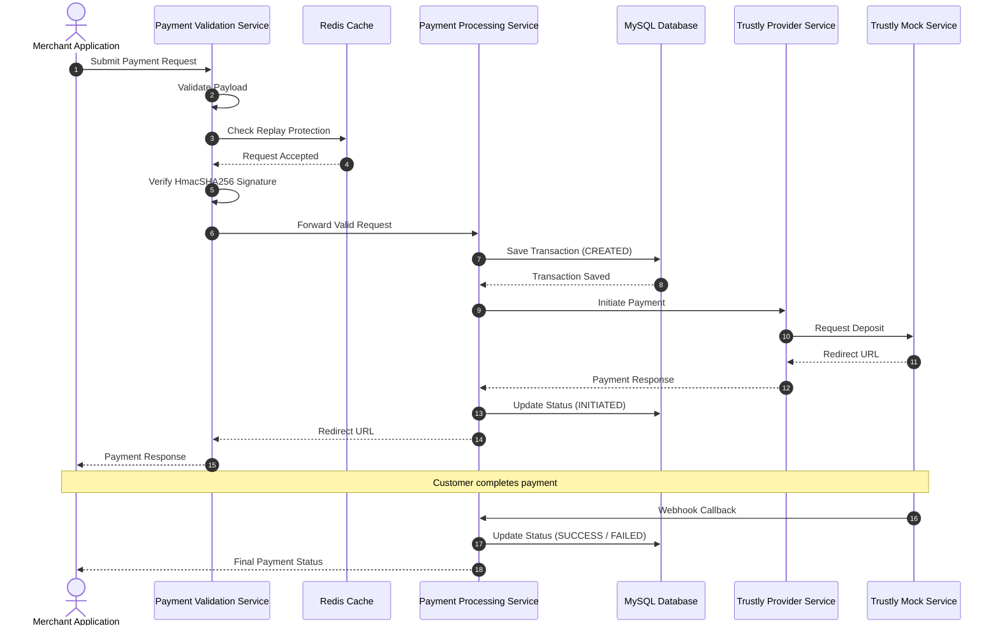

# 💳 Payment Integration System

A secure **Payment Integration Platform** built using **Java 17** and **Spring Boot Microservices**. The application enables merchants to initiate and manage payment transactions through a standardized API while integrating with the **Trustly Deposit API**.

The project demonstrates how modern payment systems validate requests, process transactions, maintain payment status, and communicate with third-party payment providers using a scalable microservices architecture.

---

# 📌 Project Overview

This project was developed during my **Java Developer Internship** to gain hands-on experience in designing and implementing a real-world payment integration platform.

The system is divided into independent microservices, where each service is responsible for a specific business function such as request validation, payment processing, or external provider integration.

The platform provides the following capabilities:

- Secure merchant request validation using **HmacSHA256**
- Payment initiation through a standardized REST API
- Integration with the **Trustly Deposit API**
- Payment lifecycle management
- Asynchronous webhook handling
- Payment status tracking
- Redis-based request validation and replay protection
- Service discovery using Netflix Eureka
- Persistent transaction storage using MySQL and Spring JDBC

The project follows RESTful API principles and demonstrates practical implementation of Java backend development concepts including Spring Boot, Spring JDBC, Spring Security, Redis, Microservices, REST APIs, and Service Discovery.

---

# 🚀 Key Features

- Secure payment request validation
- Merchant authentication using HmacSHA256 signatures
- Payment transaction tracking using UUID
- Payment status lifecycle management
- Trustly Deposit API integration
- Webhook callback processing
- Spring Boot Microservices architecture
- Redis integration for request validation
- MySQL transaction persistence using Spring JDBC
- Netflix Eureka Service Discovery
- RESTful API communication between services
- Centralized exception handling and validation

## 🏷️ Tech Stack & Key Technologies

| Category | Technologies |
|----------|--------------|
| **Programming Language** | Java 17 |
| **Framework** | Spring Boot 3.x |
| **Architecture** | Microservices |
| **Security** | Spring Security, HmacSHA256 |
| **Database** | MySQL 8, Spring JDBC (JdbcTemplate) |
| **Caching** | Redis |
| **Service Discovery** | Netflix Eureka Server |
| **REST Client** | Spring RestClient |
| **Build Tool** | Apache Maven |
| **Version Control** | Git, GitHub |
| **Testing Tools** | Postman |
| **Logging** | SLF4J, Logback |
| **Development Tools** | IntelliJ IDEA / Eclipse, MySQL Workbench |
| **Payment Gateway** | Trustly Deposit API |

## ⚙️ How the Payment Integration System Works

```text
                Merchant Application
                        │
                        │ 1. Payment Request
                        ▼
        Payment Validation Service (8081)
                        │
         • Validate Request Payload
         • Verify HmacSHA256 Signature
         • Validate Merchant Details
         • Prevent Replay Requests using Redis
                        │
                        ▼
       Payment Processing Service (8082)
                        │
         • Generate Transaction UUID
         • Save Payment Details in MySQL
         • Set Initial Payment Status
         • Process Business Logic
                        │
                        ▼
         Trustly Provider Service (8083)
                        │
         • Convert Internal Request
         • Call Trustly Deposit API
         • Receive Redirect URL
                        │
                        ▼
             Trustly Deposit API
                        │
                        ▼
          Customer Completes Payment
                        │
                        ▼
            Trustly Webhook Callback
                        │
                        ▼
       Payment Processing Service
                        │
         • Verify Callback
         • Update Payment Status
         • Notify Merchant
```

### Request Processing Flow

The payment request passes through three independent microservices, where each service performs a specific responsibility.

### 1. Payment Validation Service

The Validation Service acts as the entry point of the system.

Its responsibilities include:

- Receiving merchant payment requests
- Validating mandatory request fields
- Verifying HmacSHA256 request signatures
- Validating merchant information
- Checking replay requests using Redis
- Forwarding validated requests to the Processing Service

---

### 2. Payment Processing Service

The Processing Service manages the complete payment lifecycle.

Its responsibilities include:

- Generating a unique Transaction UUID
- Persisting payment information using Spring JDBC
- Maintaining payment status
- Calling the Trustly Provider Service
- Processing webhook callbacks
- Updating payment status in MySQL
- Sending payment response back to the merchant

---

### 3. Trustly Provider Service

The Provider Service acts as an adapter between the application and the Trustly Deposit API.

Its responsibilities include:

- Converting internal request models into Trustly API requests
- Invoking the Trustly Deposit API
- Receiving the payment redirect URL
- Returning standardized responses to the Processing Service

---

### Payment Lifecycle

Every payment follows the lifecycle below:

```
CREATED
   │
   ▼
INITIATED
   │
   ▼
PENDING
   │
   ├────────► SUCCESS
   │
   └────────► FAILED
```

This lifecycle enables the system to accurately track each payment from creation until completion.

## 🛠️ Microservices Architecture

The Payment Integration System is designed using a microservices architecture, where each service is responsible for a single business capability. All services are registered with **Netflix Eureka Server** for service discovery and communicate using REST APIs.

| Microservice | Port | Responsibilities |
|--------------|------|------------------|
| **Payment Validation Service** | **8081** | Receives merchant payment requests, validates request payload, verifies HmacSHA256 signatures, validates merchant information, checks replay requests using Redis, and forwards valid requests to the Processing Service. |
| **Payment Processing Service** | **8082** | Generates transaction UUIDs, stores payment details in MySQL using Spring JDBC, manages the payment lifecycle, processes webhook callbacks, updates payment status, and coordinates communication with the Provider Service. |
| **Trustly Provider Service** | **8083** | Acts as an adapter between the application and the Trustly Deposit API by transforming internal requests into Trustly-compatible requests and returning standardized responses. |
| **Trustly Mock Service** | **8085** | Simulates the Trustly payment gateway during development by generating redirect URLs and sending webhook callbacks for payment status updates. |
| **Netflix Eureka Server** | **8761** | Provides service registration and discovery for all microservices within the platform. |

---

### Service Responsibilities

### 🔹 Payment Validation Service

- Entry point for merchant payment requests
- Request payload validation
- HmacSHA256 signature verification
- Merchant validation
- Redis-based replay request protection
- Forwards validated requests to the Processing Service

---

### 🔹 Payment Processing Service

- Generates unique Transaction UUID
- Stores payment details using Spring JDBC
- Maintains payment lifecycle
- Invokes Provider Service
- Handles payment webhook callbacks
- Updates payment status
- Sends final response to merchants

---

### 🔹 Trustly Provider Service

- Converts internal request models
- Calls the Trustly Deposit API
- Handles provider responses
- Returns redirect URL
- Isolates third-party integration logic

---

### 🔹 Trustly Mock Service

- Simulates Trustly payment gateway
- Generates mock redirect URLs
- Sends payment status callbacks
- Supports local development and testing

---

### 🔹 Eureka Server

- Registers all microservices
- Enables service discovery
- Eliminates hardcoded service URLs
- Supports scalable service-to-service communication

## 🏗️ System Architecture Diagram



## 🏛️ Architecture Principles

The Payment Integration System follows modern backend architecture principles to ensure scalability, maintainability, and secure payment processing.

- Single Responsibility Principle
- Stateless REST APIs
- Microservices Architecture
- Database per Service
- Provider Abstraction Layer
- Centralized Payment Processing
- Service Discovery using Netflix Eureka
- Redis-based Replay Protection
- Asynchronous Webhook Processing

## 🔄 End-to-End Payment Flow Diagram



## 🔐 Security & Data Integrity

Security is an essential part of the Payment Integration System. The application validates every incoming payment request before processing transactions to ensure data integrity and protect against unauthorized access.

### HmacSHA256 Request Verification

The Payment Validation Service verifies the HmacSHA256 signature included in every merchant request. This ensures that the request has not been modified during transmission and is sent by an authorized merchant.

**Verification Process**

- Merchant generates an HmacSHA256 signature using a shared secret.
- The signature is sent along with the payment request.
- The Validation Service recalculates the signature.
- If both signatures match, the request is accepted; otherwise, it is rejected.

---

### Request Validation

Before processing a payment request, the Validation Service performs multiple validation checks:

- Mandatory field validation
- Merchant information validation
- Request payload validation
- Business rule validation

Only valid requests are forwarded to the Payment Processing Service.

---

### Redis-Based Replay Protection

Redis is used to prevent duplicate or replayed requests.

For each incoming payment request:

- The request is validated.
- Duplicate requests are identified.
- Previously processed requests are rejected.
- Only unique requests continue to the payment processing workflow.

---

### Secure Payment Processing

The Payment Processing Service ensures that every payment transaction is uniquely identified by generating a UUID for each request.

The service is responsible for:

- Creating payment records
- Updating payment status
- Processing webhook callbacks
- Maintaining transaction history

---

### Payment Status Lifecycle

Each payment follows a predefined lifecycle throughout the system.

| Status | Description |
|---------|-------------|
| **CREATED** | Payment request received and stored. |
| **INITIATED** | Payment request successfully sent to the provider. |
| **PENDING** | Waiting for payment completion. |
| **SUCCESS** | Payment completed successfully. |
| **FAILED** | Payment could not be completed. |

---

### Exception Handling

The application uses centralized exception handling to provide consistent API responses for validation failures, business exceptions, and unexpected system errors.

---

### Logging

SLF4J and Logback are used to record application events, request processing, and error information, making debugging and monitoring easier during development.

## 📖 API Reference

The Payment Integration System exposes RESTful APIs that allow merchant applications to initiate payment transactions and receive payment status updates.

---

### Initiate Payment

**Endpoint**

```http
POST /api/v1/payments/initiate
```

---

### Request Headers

| Header | Description |
|---------|-------------|
| Content-Type | application/json |
| X-Merchant-Id | Merchant Identifier |
| X-Signature | HmacSHA256 Signature |
| X-Timestamp | Request Timestamp |

---

### Sample Request

```json
{
    "merchantReference": "ORDER-10001",
    "amount": 500.00,
    "currency": "EUR",
    "customerName": "John Doe",
    "customerEmail": "john@example.com"
}
```

---

### Success Response

```json
{
    "txnReference": "1f4d4b2b-adc8-47a0-b0fc-b73558cf5949",
    "txnStatus": "PENDING",
    "url": "http://localhost:8085/?token=b52075e6-5af3-4fa5-a008-90136f034a60"
}
```

---

### Payment Status Lifecycle

| Status | Description |
|---------|-------------|
| CREATED | Payment record created successfully |
| INITIATED | Payment request sent to Trustly Provider |
| PENDING | Waiting for customer payment completion |
| SUCCESS | Payment completed successfully |
| FAILED | Payment failed |

---

### Payment Callback

After the customer completes the payment, the Trustly Mock Service sends a webhook callback to the Payment Processing Service.

The Processing Service:

- Validates the callback
- Updates the payment status
- Stores the latest transaction state
- Sends the updated status to the merchant application

## 🚀 How to Run Locally

### Prerequisites

Before running the application, make sure the following software is installed:

- Java 17
- Apache Maven 3.9+
- MySQL 8.x
- Redis Server
- Git
- IntelliJ IDEA / Eclipse
- Postman (for API testing)

---

## Clone the Repository

```bash
git clone https://github.com/Akash-Ritpurkar/payment-integration-system.git

cd payment-integration-system
```

---

## Project Structure

```text
payment-integration-system
│
├── database
├── eureka-service-registry
├── payment-validation-service
├── payment-processing-service
├── trustly-provider-service
├── trustly-mock-service
├── README.md
└── .gitignore
```

---

## Configure MySQL

Create a database.

```sql
CREATE DATABASE payment_db;
```

Update the database configuration inside each service.

```properties
spring.datasource.url=jdbc:mysql://localhost:3306/payment_db
spring.datasource.username=root
spring.datasource.password=your_password
```

---

## Configure Redis

Start the Redis server before running the application.

Default configuration:

```text
Host : localhost
Port : 6379
```

---

## Build the Project

From the project root directory run:

```bash
mvn clean install
```

---

## Start the Services

Start the microservices in the following order:

### 1. Eureka Server

```
http://localhost:8761
```

---

### 2. Trustly Provider Service

Runs on:

```
http://localhost:8083
```

---

### 3. Payment Processing Service

Runs on:

```
http://localhost:8082
```

---

### 4. Payment Validation Service

Runs on:

```
http://localhost:8081
```

---

### 5. Trustly Mock Service

Runs on:

```
http://localhost:8085
```

---

## Verify Eureka Registration

Open:

```
http://localhost:8761
```

Verify that the following services are registered:

- PAYMENT-VALIDATION-SERVICE
- PAYMENT-PROCESSING-SERVICE
- TRUSTLY-PROVIDER-SERVICE

---

## Test the Application

Use Postman to invoke the Payment Validation API.

The request flows through:

```text
Merchant
      │
      ▼
Validation Service
      │
      ▼
Processing Service
      │
      ▼
Provider Service
      │
      ▼
Trustly Mock
      │
      ▼
Webhook
      │
      ▼
Processing Service
```

---

## Expected Payment Flow

```
CREATED
     │
     ▼
INITIATED
     │
     ▼
PENDING
     │
 ┌───┴────┐
 ▼        ▼
SUCCESS FAILED
```

---

## Common Issues

### Service not registered in Eureka

- Verify Eureka Server is running first.
- Check `eureka.client.service-url.defaultZone`.

---

### Database Connection Error

- Verify MySQL is running.
- Ensure `payment_db` exists.
- Check username and password.

---

### Redis Connection Error

- Verify Redis Server is running.
- Confirm Redis host and port configuration.

---

### Build Failure

Run:

```bash
mvn clean install
```

before starting any service.

## ✨ Project Highlights

- Developed a secure payment integration platform using Java 17 and Spring Boot Microservices.
- Implemented HmacSHA256-based request authentication for secure merchant communication.
- Designed independent microservices for validation, processing, and provider integration.
- Integrated the Trustly Deposit API through a dedicated provider service.
- Managed payment lifecycle using Spring JDBC and MySQL.
- Used Redis to support request validation and replay protection.
- Implemented webhook handling for asynchronous payment status updates.
- Registered all services using Netflix Eureka for service discovery.
- Built RESTful APIs following layered architecture and clean coding principles.

## 📁 Project Structure

```text
payment-integration-system
│
├── common-library
│
├── eureka-server
│
├── payment-validation-service
│   ├── controller
│   ├── service
│   ├── validator
│   ├── security
│   └── configuration
│
├── payment-processing-service
│   ├── controller
│   ├── service
│   ├── dao
│   ├── entity
│   └── webhook
│
├── trustly-provider-service
│   ├── client
│   ├── mapper
│   ├── service
│   └── configuration
│
└── trustly-mock-service
```
## 🎯 Design Patterns Used

The project applies several software design patterns commonly used in enterprise Java applications.

- Layered Architecture
- Adapter Pattern (Trustly Provider Service)
- DTO Pattern
- Dependency Injection
- Service Registry Pattern (Netflix Eureka)
- Builder Pattern (Lombok)

## 📚 Learning Outcomes

Through this project, I gained practical experience in:

- Designing Microservices Architecture
- Building RESTful APIs using Spring Boot
- Spring Security fundamentals
- HmacSHA256 request authentication
- Spring JDBC with MySQL
- Redis integration
- Netflix Eureka Service Discovery
- External API integration
- Payment gateway workflow
- Webhook processing
- Exception handling
- Logging using SLF4J and Logback
- Layered architecture and clean code practices


## 📄 License

This project was developed as part of my Java Developer Internship for educational and portfolio purposes.

The repository is shared to showcase my backend development skills and demonstrate the implementation of a payment integration system using Java, Spring Boot, Microservices, Spring JDBC, Redis, and REST APIs.

## 👨‍💻 Author

**Akash Ritpurkar**

Java Backend Developer

- 🎓 Mechanical Engineering Graduate (2022)
- 💼 Java Developer Intern
- 🌱 Passionate about Java, Spring Boot, Microservices, and Backend Development

### Connect with Me

- GitHub: https://github.com/ARR742000
- Email: ritpurkarakash@gmail.com